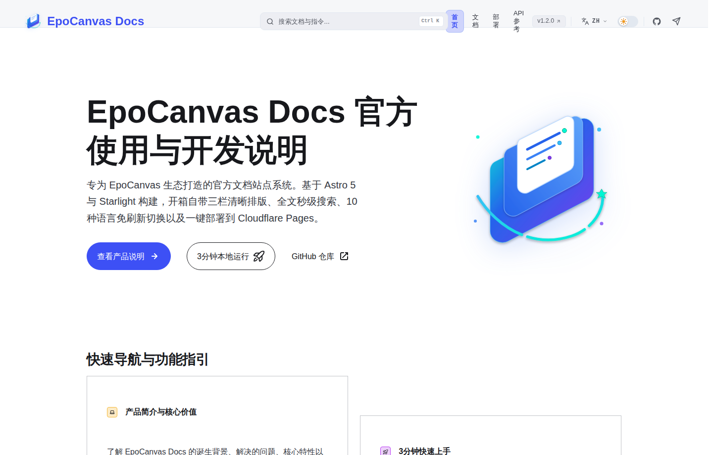

# EpoCanvas Docs

[](https://github.com/shijianus/epocanvas-docs/releases)
[](https://github.com/shijianus/epocanvas-docs/actions/workflows/build.yml)
[](./LICENSE)
[](https://astro.build)

[English](./README.md) | [简体中文](./README.zh-CN.md) | [繁體中文](./README.zh-TW.md) | [Français](./README.fr.md) | [Español](./README.es.md) | [Deutsch](./README.de.md) | [Português](./README.pt.md) | [Русский](./README.ru.md) | [日本語](./README.ja.md) | [한국어](./README.ko.md)

EpoCanvas Docs ist die offizielle Dokumentationsseite des EpoCanvas-Projekts. Sie basiert auf Astro 5 und Starlight und bringt von Haus aus ein dreispaltiges Leselayout, eine Suche mit zwei Modi und vollständig mehrsprachige Inhalte mit. Alle Inhalte sind in normalem Markdown geschrieben und werden auf Cloudflare Pages veröffentlicht.

**Live-Website**: [https://docs.epocanvas.com](https://docs.epocanvas.com) (Spiegel: [https://epocanvas-docs.pages.dev](https://epocanvas-docs.pages.dev))

## Vorschau



Die Website verwendet ein dreispaltiges Layout: links die Kategorie-Navigation, in der Mitte der Artikeltext, rechts das Inhaltsverzeichnis der aktuellen Seite. Das dunkle Design ist voreingestellt, folgt der Systemeinstellung und lässt sich in der Kopfzeile manuell umschalten.

## Funktionen

- **Dreispaltiges Leselayout** — die Inhaltsbreite ist für langes Lesen begrenzt; die Seitenleiste behält ihre Scrollposition beim Seitenwechsel, und die rechte Gliederung hebt den aktuellen Abschnitt beim Scrollen hervor.
- **Suche mit zwei Modi** — das Suchfeld in der Kopfzeile findet Treffer auf der aktuellen Seite, mit `Ctrl+K` / `Cmd+K` öffnet sich ein websiteweiter Suchdialog auf Basis von Pagefind. Der Index wird beim Build erzeugt, alle Abfragen laufen im Browser ohne fremde Suchdienste — die Website funktioniert daher auch in Intranets ohne ausgehenden Internetzugang.
- **Vollständig mehrsprachige Inhalte** — Oberfläche und Artikeltexte sind in 10 Sprachen verfügbar: Vereinfachtes Chinesisch (Standard), Traditionelles Chinesisch, Englisch, Japanisch, Koreanisch, Spanisch, Französisch, Deutsch, Russisch und Portugiesisch. Jede Sprache liegt unter ihrem eigenen URL-Präfix (z. B. `/de/`); Seiten ohne Übersetzung zeigen statt eines 404 automatisch die chinesische Fassung.
- **Markdown-Erweiterungen** — vier Hinweisbox-Typen (`:::note`, `:::tip`, `:::caution`, `:::danger`), Shiki-Code-Hervorhebung mit Dateinamen-Labels, Zeilen-Hervorhebung und Diff-Darstellung.
- **Bereitstellung mit einem Befehl** — die Website wird zu statischen Dateien gebaut und mit einem einzigen Befehl auf Cloudflare Pages veröffentlicht; eigene Domains und HTTPS-Zertifikate werden automatisch eingerichtet.

## Voraussetzungen

- Node.js 20 oder neuer (18.17+ wird unterstützt)
- pnpm 10

## Schnellstart

```bash
git clone https://github.com/shijianus/epocanvas-docs.git
cd epocanvas-docs
pnpm install
pnpm run dev
```

Öffnen Sie `http://localhost:4321` im Browser. Während der Entwicklungsserver läuft, werden Markdown-Änderungen sofort übernommen.

### Befehle

| Befehl | Beschreibung |
| :--- | :--- |
| `pnpm run dev` | Startet den lokalen Entwicklungsserver mit Hot Reload |
| `pnpm run build` | Baut die statische Website nach `dist/` und erzeugt den Suchindex |
| `pnpm run preview` | Zeigt das Build-Ergebnis lokal an |
| `pnpm run deploy` | Baut und veröffentlicht auf Cloudflare Pages |

## Projektstruktur

```text
epocanvas-docs/
├── public/images/canvas/       # Screenshots und Diagramme der Dokumentation
├── src/
│   ├── components/starlight/   # Überschriebene Starlight-Komponenten (Header, Sidebar, …)
│   ├── config/navigation.ts    # Konfiguration der oberen Navigationsleiste
│   ├── content/docs/           # Dokumentationsinhalte je Sprache (canvas/ = Chinesisch, en/ ja/ … = Übersetzungen)
│   ├── styles/custom.css       # Themenfarben und Layout-Stile
│   └── utils/i18n.ts           # Oberflächentexte und Sprachregister
├── astro.config.mjs            # Site-Konfiguration: Titel, Sidebar, Weiterleitungen
├── AGENTS.md                   # Leitfaden für das technische Schreiben
├── LICENSE
└── package.json
```

## Dokumentation schreiben

1. Legen Sie eine neue `.md`-Datei unter `src/content/docs/canvas/` an.
2. Ergänzen Sie am Dateianfang das Frontmatter:

   ```yaml
   ---
   title: Dokumenttitel
   description: Eine Ein-Satz-Beschreibung der Seite
   ---
   ```

3. Registrieren Sie die Seite im `sidebar`-Array in `astro.config.mjs`; nicht registrierte Seiten erscheinen nicht in der Navigation.
4. Legen Sie Bilder in `public/images/canvas/` ab und verweisen Sie mit absolutem Pfad darauf:

   ```markdown
   
   ```

Führen Sie vor dem Commit `pnpm run build` aus, um zu prüfen, dass die Website fehlerfrei baut.

## Bereitstellung

Die Website wird auf Cloudflare Pages gehostet:

- **Lokale Veröffentlichung** — einmal `wrangler login` zur Autorisierung ausführen; danach baut und veröffentlicht `pnpm run deploy` die Website.
- **Eigene Domain** — öffnen Sie in der Cloudflare-Verwaltung das Pages-Projekt `epocanvas-docs` und legen Sie die Domain unter *Custom domains* an. CNAME-Eintrag und SSL-Zertifikat werden automatisch eingerichtet.

## Mitwirken

Issues und Pull Requests sind willkommen. Bitte führen Sie vor dem Einreichen eines PR lokal `pnpm run build` aus und stellen Sie sicher, dass der Build durchläuft.

## Lizenz

[MIT](./LICENSE)
