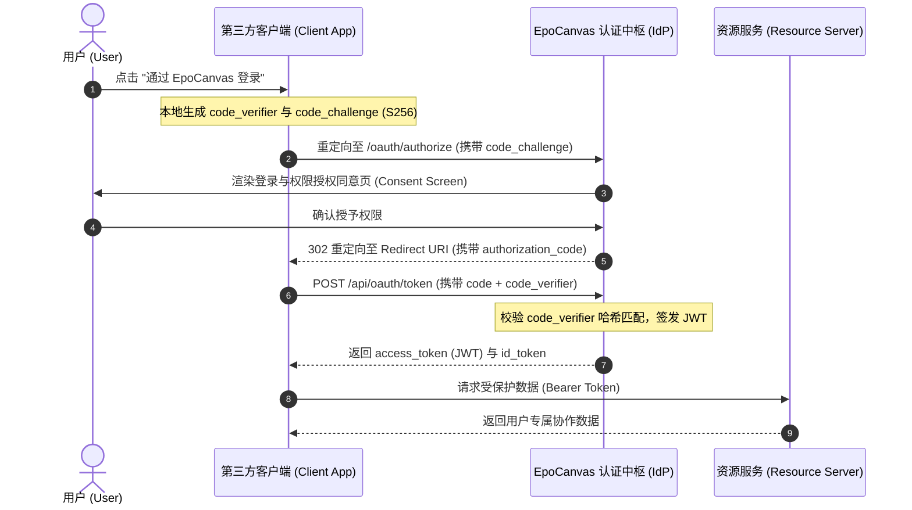

在现代化分布式协作架构中，统一且高安全的身份认证中枢是连接各业务子系统的基石。EpoCanvas 不仅是一套独立的去中心化协作中枢，更是一座开箱即用的企业级 **OAuth 2.0 与 OpenID Connect (OIDC) 单点登录 (SSO) 身份提供商（Identity Provider, IdP）**。开发者可将个人独立博客、团队 Wiki、画板微服务、项目管理系统（如 Jira / GitLab）无缝接入 EpoCanvas，实现“一次认证，全域通行”。


---

## 🏛️ 1. OIDC 标准协议端点规范

EpoCanvas 完全遵循 IETF RFC 6749、RFC 7636 (PKCE) 与 OpenID Connect Core 1.0 规范，对外暴露标准端点：

| 协议端点路径 | HTTP 方法 | 端点职责与规范说明 |
| :--- | :--- | :--- |
| **`/.well-known/openid-configuration`** | `GET` | **OIDC Discovery 元数据**，自动化下发授权端点、令牌端点、公钥集 (JWKS) 与 Scopes 清单 |
| **`/oauth/authorize`** | `GET` | **用户交互授权端点**，展示第三方应用详情、请求的权限作用域与【确认授权】界面 |
| **`/api/oauth/token`** | `POST` | **令牌置换端点**，接收 `authorization_code` 换取 `access_token` 与 `id_token` |
| **`/api/oauth/userinfo`** | `GET` / `POST` | **用户信息端点**，持有 Bearer Token 换取脱敏的用户身份资料与公钥指纹 |
| **`/api/oauth/revoke`** | `POST` | **令牌撤回端点**，主动注销第三方应用的刷新令牌与会话权限 |

---

## 🛠️ 2. 开发者应用注册与安全凭据管理

系统管理员或授权开发者可在后台【OAuth 开放平台】注册受信任的客户端应用：

1. **基本属性配置**：
   - 应用名称、Logo 图标、主页地址（Homepage URL）、应用描述。
2. **凭据签发与加密**：
   - **Client ID**：系统自动生成形如 `epo_app_shijianus_blog_prod` 的公开客户端标识。
   - **Client Secret**：仅在初次创建时明文展示一次的高熵安全机密。
3. **合法重定向回调清单 (Redirect URIs)**：
   严格限定授权成功后可重定向的回调地址列表（支持配置开发环境 `http://localhost:4321/auth/callback` 与生产线上域名）。握手时执行精确校验，严防回调劫持攻击。
4. **权限作用域 (Scopes) 限制**：按需分配最小权限集，防止越权访问。

---

## 🔄 3. 标准授权码与 PKCE 交互流程 (Sequence Diagram)

对于前端单页面应用 (SPA) 或移动端 App，EpoCanvas 强制要求使用具备 **PKCE（Proof Key for Code Exchange）** 防护的授权流程：



---

## 🔐 4. 细粒度权限作用域 (Duotone Scopes)

在用户授权界面，权限被划分为直观的双色调（Duotone）安全分级展示：

| 作用域标识 (Scope) | 权限中文说明 | 安全分级 | 涉及数据范畴 |
| :--- | :--- | :--- | :--- |
| **`openid`** | 用户唯一主体标识 | 基础信任 | 用户的不可变唯一 UUID 与 homeserver 命名空间 |
| **`profile`** | 基础个人资料 | 基础信任 | 昵称、个性签名、头像 URL、语言偏好 |
| **`email`** | 关联邮箱身份 | 敏感凭据 | 绑定的通知邮箱与主账号地址 |
| **`rooms.read`** | 频道列表与成员 | 敏感数据 | 允许第三方应用读取已加入的公开/受保护频道名称 |
| **`events.write`**| 代表用户发送事件 | 高危操作 | 允许第三方系统（如告警机器人）向指定频道发消息 |
| **`canvas.collab`**| 参与画板协同图元 | 协作特权 | 允许外部设计工具同步图层到 EpoCanvas 画布 |

---

## 💻 5. 第三方应用快速接入实战代码 (Node.js)

以标准 Web 服务为例，使用第三方 OIDC Client 库接入 EpoCanvas：

```typescript
import { Issuer } from 'openid-client';

async function setupOIDC() {
  // 1. 自动发现 EpoCanvas 认证中枢元数据
  const epocanvasIssuer = await Issuer.discover('https://chat.example.com');
  
  // 2. 初始化客户端实例
  const client = new epocanvasIssuer.Client({
    client_id: 'epo_app_wiki_internal',
    client_secret: process.env.EPO_CLIENT_SECRET,
    redirect_uris: ['https://wiki.example.com/api/auth/callback'],
    response_types: ['code'],
  });

  // 3. 生成带 PKCE 挑战的授权跳转链接
  const code_verifier = generators.codeVerifier();
  const code_challenge = generators.codeChallenge(code_verifier);

  const authorizationUrl = client.authorizationUrl({
    scope: 'openid profile email rooms.read',
    code_challenge,
    code_challenge_method: 'S256',
  });

  return { client, authorizationUrl };
}
```
