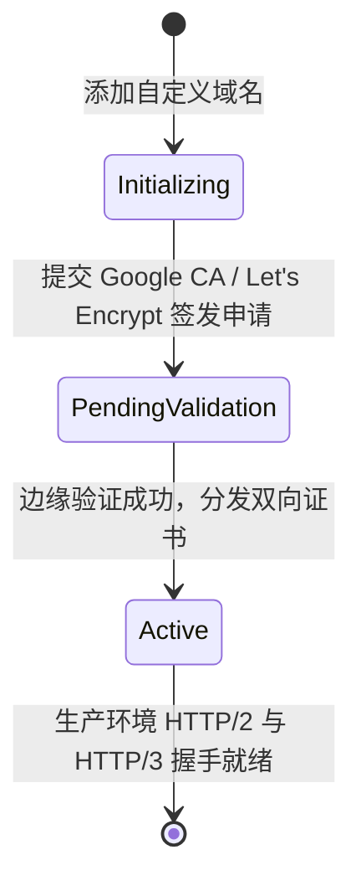

# Cloudflare Pages 边缘即时部署指南

> [!NOTE]
> **EpoCanvas Docs** 官方生产环境托管于 **Cloudflare Pages** 边缘计算平台。借助 Cloudflare 遍布全球 300 多个核心城市的 Anycast 边缘网络，全站静态资源实现毫秒级首字节到达（TTFB < 50ms），并原生享有免费 Universal SSL 加密与全球 DDoS 攻击防御。

---

## 1. 边缘部署与全球分发拓扑

从本地构建打包到全球边缘节点生效的完整交付流水线如下：


---

## 2. 为什么选择 Cloudflare Pages 边缘托管

| 对比维度 | 传统 Nginx 虚拟主机 / 容器 | Cloudflare Pages 边缘云 |
| :--- | :--- | :--- |
| **机房分布** | 单一物理机房或少数可用区 | **全球 300+ 城市 Anycast 边缘节点** |
| **首字节时间 (TTFB)** | 跨国访问通常需 300~800ms | **全球任意地区访问普遍 < 50ms** |
| **运维与维护成本** | 需维护 OS、Nginx、安全补丁 | **零运维（Serverless），免服务器维护** |
| **SSL 证书生命周期** | 需配置 Certbot 定期续签 | **自动申请与轮转 Cloudflare Universal SSL** |
| **并发承载力** | 受单机带宽与 CPU 限制 | **无上限抗海量并发与原生 DDoS 清洗** |

---

## 3. 本地与 CLI 一键部署实操

专案在 `package.json` 中预置了连贯部署指令，本地开发者或 CI 代理无需手动压缩上传：

```bash
# 执行完整构建并直接推送至 Cloudflare Pages 边缘集群
pnpm run deploy
# 或
pnpm run cf:deploy
```

### 3.1 底层执行指令与参数解析：
```bash
pnpm run build && wrangler pages deploy dist --project-name epocanvas-docs --branch main --commit-dirty=true
```

| 参数选项 | 核心作用与工程含义 |
| :--- | :--- |
| `dist` | 指定静态输出产物目录（包含编译好的 HTML、CSS、JS 及 Pagefind 索引） |
| `--project-name epocanvas-docs` | 绑定 Cloudflare 控制台中注册的官方专案名称 |
| `--branch main` | 指定生产环境发布分支，确保部署进入 Production 环境而非临时 Preview |
| `--commit-dirty=true` | 允许在本地存在未打标修改或构建临时文件时继续上传，避免中断流水线 |

### 3.2 部署过程终端输出示例：
```
✨ Successfully built static site into dist/
Uploading dist/ (38 files)
✨ Success! Uploaded 38 files (2.4 sec)
✨ Deployment complete! Take a peek over at:
   https://epocanvas-docs.pages.dev
```

---

## 4. 自定义域名绑定与 SSL 证书链 (`doc.epocanvas.com`)

EpoCanvas Docs 配置了专属的权威二级域名 `doc.epocanvas.com`：

### 4.1 DNS 记录映射规范：
在 Cloudflare DNS 管理控制台中，为 `epocanvas.com` 添加一条 CNAME 记录：
- **类型 (Type)**：`CNAME`
- **名称 (Name)**：`doc`
- **目标 (Target)**：`epocanvas-docs.pages.dev`
- **代理状态 (Proxy status)**：开启（Proxied 橘色云朵，享受 CDN 加速与 WAF 防护）

### 4.2 Universal SSL 证书分发状态机：


---

## 5. 边缘缓存策略与 HTTP 标头规范

Cloudflare Pages 默认配置了极佳的静态资源缓存调度：
- **HTML 页面 (`/` / `/canvas/*`)**：
  ```http
  cache-control: public, max-age=0, must-revalidate
  ```
  保证当有新版本部署时，全球用户在下一次刷新时能瞬时获取最新文档，杜绝缓存死锁。
- **带有内容指纹的静态资源 (`/_astro/*.css`, `/_astro/*.js`)**：
  文件自带哈希指纹，启用 `max-age=31536000, immutable` 强缓存，实现秒开且绝不污染新版。

---

## 6. 生产环境连通性验证命令

通过 `curl` 命令行工具快速验证边缘节点返回状态：

```bash
# 验证官方 Pages.dev 域名
curl -sI https://epocanvas-docs.pages.dev | head -n 5

# 验证官方自定义独立域名
curl -sI https://doc.epocanvas.com | head -n 5
```

预期标准输出：
```http
HTTP/2 200
date: Fri, 11 Sep 2026 12:45:00 GMT
content-type: text/html; charset=utf-8
server: cloudflare
```
返回 `HTTP/2 200` 即证明边缘交付管线完全正常运作。
