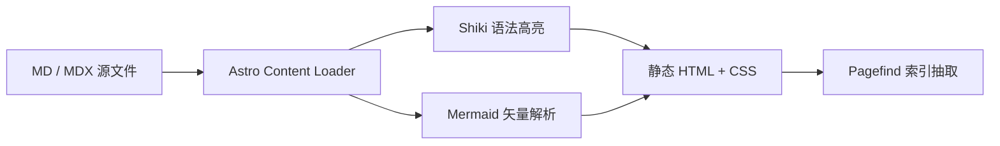

# 内容集合与 Markdown/MDX 撰写规范

> [!NOTE]
> **EpoCanvas Docs** 全面拥抱 **Astro 5 Content Layer** 规范。所有技术文档均通过类型安全的集合模式进行声明，结合增强型 Markdown 与 MDX 扩展语法，为撰写高精度技术规范、架构图表与交互卡片提供了标准化支撑。

---

## 1. 内容集合配置规范 (`src/content.config.ts`)

在 Astro 5 中，文档集合的模式定义由根目录的 `src/content.config.ts` 集中管理：

```typescript
import { defineCollection, z } from 'astro:content';
import { docsLoader } from '@astrojs/starlight/loaders';
import { docsSchema } from '@astrojs/starlight/schema';

export const collections = {
  docs: defineCollection({
    loader: docsLoader(),
    schema: docsSchema({
      extend: z.object({
        // 允许在此扩展专属的文档元数据字段
        badge: z.string().optional(),
        lastVerified: z.string().optional(),
      }),
    }),
  }),
};
```

### 类型安全保障机制：
- 在执行 `pnpm run build` 或本地开发热重载时，Astro 将依据 Schema 自动校验所有文档前置元数据（Frontmatter）。
- 若存在缺少必填字段（如 `title`）、类型不匹配或链接断裂的情况，构建管线将在毫秒内阻断并精确输出报错文件与行号，从源头避免线上脏数据。

---

## 2. Frontmatter 元数据标准规范

每一篇技术文档头部均须包含标准的 YAML Frontmatter 结构：

```yaml
---
title: 文档核心主标题
description: 概括本篇技术文档的核心内容（不超过 100 字，用于 SEO 与社交分享摘要）
template: doc # 可选: 'doc' (默认三栏文档页) 或 'splash' (全宽落地首页)
sidebar:
  label: 侧边栏短标题 # 当文件名过长时，在侧边栏显示的精简标题
  order: 1 # 同级目录下的排列权重数字（越小越靠前）
  badge:
    text: 新增 # 侧边栏条目旁显示的胶囊徽标
    variant: success # 可选: note | tip | danger | caution | success
---
```

---

## 3. 增强型排版语法支持

### 3.1 GitHub-Style 5 级警示块 (Callout Alerts)
EpoCanvas Docs 原生解析 5 种具备不同语义色彩的警示块：

> [!NOTE]
> **NOTE (背景说明)**：用于阐述技术背景、实现细节或补充性上下文。

> [!TIP]
> **TIP (最佳实践)**：用于提供性能调优建议、快捷技巧或工程效率建议。

> [!IMPORTANT]
> **IMPORTANT (关键要求)**：必须严格遵循的前置条件、关键配置或不可忽视的规范。

> [!WARNING]
> **WARNING (潜在风险)**：可能导致破坏性变更、兼容性冲突或异常的问题警告。

> [!CAUTION]
> **CAUTION (高危操作)**：涉及数据丢失、不可逆删除或生产安全的高危警示。

---

### 3.2 Shiki 代码高亮与增量 Diff 标记
文档引擎深度集成了 Shiki 语法高亮器，支持上百种编程语言，并内置了丰富的高级标注语法：

#### 带有文件名标题与行号的代码块：
```typescript title="src/utils/math.ts" {3-4}
export function add(a: number, b: number): number {
  // 高亮第 3 至第 4 行
  const sum = a + b;
  return sum;
}
```

#### 增量对比 (Diff) 标记语法：
```diff
  export default defineConfig({
-   site: 'http://localhost:3000',
+   site: 'https://doc.epocanvas.com',
  });
```

---

### 3.3 原生 Mermaid 图表撰写规范
无需在外部画图软件导出截图，直接使用 ```mermaid 围栏代码块即可在页面上渲染无损矢量架构图：



---

### 3.4 常用 Starlight 内置富文本组件
在 `.mdx` 文件中，可以直接引入官方交互组件，提升技术文档的交互质感：

```mdx
import { Tabs, TabItem, Steps, Card, CardGrid } from '@astrojs/starlight/components';

<Tabs>
  <TabItem label="pnpm">
    ```bash
    pnpm install
    ```
  </TabItem>
  <TabItem label="npm">
    ```bash
    npm install
    ```
  </TabItem>
</Tabs>

<Steps>
1. 克隆代码仓库并进入工作区。
2. 安装环境所需的全局 Node 与 pnpm 依赖。
3. 执行构建与本地热更新服务。
</Steps>
```

---

## 4. 文档命名规范与资产存放约定

为保持工程统一与多平台兼容，请严格遵守以下协作约定：
1. **文件名规范**：统一使用小写英文字母与中划线（kebab-case），如 `system-config.md`，严禁使用空格与中文字符；
2. **图片资产归档**：
   - 静态插图统一归档至 `public/images/canvas/`；
   - 引用路径必须以绝对路径开头：``；
   - 优先推荐使用矢量图格式（`.svg`），确保在 Retina 高分屏下无锯齿失真；若使用位图，建议使用 `.png` 或经过 Sharp 压缩的 `.webp`。
