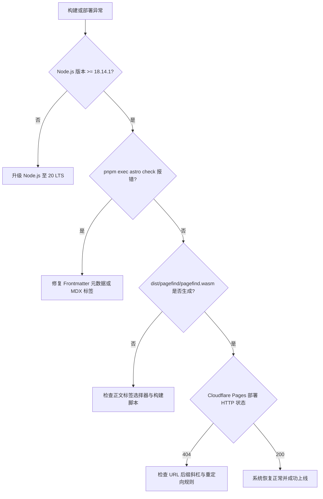

# 生产运维与故障排查手册

> [!NOTE]
> 本手册为 **EpoCanvas Docs** 生产运维与本地开发的高频故障诊断指南（Runbook）。系统化梳理了从 Astro 5 构建期语法校验、Pagefind 索引生成异常、Cloudflare Pages 边缘分发阻断到 CSS 层叠样式冲突的根本原因与标准自愈步骤。

---

## 1. 故障诊断流程与决策树

当遇到构建中断或页面渲染异常时，请依照以下自查顺序进行排查：



---

## 2. Astro 5 构建期高频故障诊断

### 2.1 Frontmatter Schema 校验不通过
- **典型报错**：
  ```
  [AstroContentError] "title" is required in "src/content/docs/canvas/xxx.md"
  ```
- **根本原因**：
  文档头部缺少必填的 YAML 元数据字段，或缩进格式错误导致 YAML 解析器无法识别。
- **排障方案**：
  检查对应 Markdown 文件头部，确保包含标准的 `---` 围栏与合法字段：
  ```yaml
  ---
  title: 文档标题
  description: 简明描述文本
  ---
  ```

---

### 2.2 Sharp 图像处理原生模块缺失
- **典型报错**：
  ```
  Error: Could not load the "sharp" module using the linux-x64 runtime
  ```
- **根本原因**：
  在切换 Node.js 大版本或使用不同架构的容器后，Sharp 本地预编译二进制文件与当前操作系统不兼容。
- **排障方案**：
  强制重新安装 platform-specific 依赖：
  ```bash
  rm -rf node_modules pnpm-lock.yaml
  pnpm install
  ```

---

## 3. Pagefind 静态全文检索异常诊断


### 3.1 检索索引未生成或提示 `No indexable text found`
- **根本原因**：
  Astro 打包未输出到 `dist/` 目录，或页面模板缺少 `<main>` 语义化标签导致 Pagefind 选择器抓取落空。
- **排障步骤**：
  1. 确认构建产物目录存在：
     ```bash
     ls -la dist/index.html
     ```
  2. 手动在终端执行 Pagefind 独立扫描并观察详细输出：
     ```bash
     npx pagefind --site dist --verbose
     ```

---

### 3.2 客户端按下 `Cmd+K` 无响应或控制台报错
- **根本原因**：
  浏览器的 Content Security Policy (CSP) 策略阻断了 WebAssembly 编译，或 `Search.astro` 未能正确挂载快捷键监听器。
- **排障步骤**：
  1. 检查浏览器 Console 是否存在 `CompileError: WebAssembly.instantiate`；
  2. 确保 HTTP 响应头未禁止 `wasm-unsafe-eval`。Cloudflare Pages 默认策略原生支持该特性。

---

## 4. Cloudflare Pages 边缘部署高频问题

### 4.1 访问自定义域名返回 `Error 525 / SSL Handshake Failed`
- **根本原因**：
  新增的自定义域名（如 `doc.epocanvas.com`）在 Cloudflare 边缘端证书签发流程尚处于 `initializing` 阶段，CA 验证存在 5~10 分钟传播延迟。
- **排障方案**：
  1. 在 Cloudflare 控制台确认 DNS CNAME 记录代理状态为 Proxied（橘色云朵）；
  2. 耐心等待 5 分钟，或临时直接通过官方分配的边缘域名 `https://epocanvas-docs.pages.dev` 访问验证，该域名受默认通配符证书保护，即时生效。

---

### 4.2 路由死循环 (`ERR_TOO_MANY_REDIRECTS`)
- **根本原因**：
  在 `astro.config.mjs` 中配置了相互重定向（如 `/a -> /b` 同时存在 `/b -> /a`），或重定向目标包含了末尾斜杠不一致的递归规则。
- **排障方案**：
  排查 `astro.config.mjs` 中的 `redirects` 映射表，确保所有目标 URL 唯一且单向终结：
  ```javascript
  redirects: {
    '/mail': '/canvas', // 正确：单向终结重定向
  }
  ```

---

## 5. CSS 样式层叠冲突与布局异常

### 5.1 移动端出现横向滚动条 (Horizontal Overflow)
- **根本原因**：
  正文中插入的宽表格、长代码块或内联 SVG 指定了固定像素宽度（如 `width: 1000px`），打破了视口容器边界。
- **排障方案**：
  1. 在 `src/styles/custom.css` 中为大尺寸元素注入最大宽度自适应属性：
     ```css
     svg,
     img,
     pre {
       max-width: 100%;
       height: auto;
     }
     ```
  2. 表格容器添加横向滚动包裹层：`overflow-x: auto`。

---

## 6. 一键健康巡检脚本 (Health Check Script)

在本地根目录下可运行以下复合检测指令快速诊断当前工程健康度：

```bash
echo "=== 1. TypeScript & Astro 检查 ===" && pnpm exec astro check && \
echo "=== 2. 全量静态构建测试 ===" && pnpm run build && \
echo "=== 3. Pagefind 索引产物验证 ===" && test -f dist/pagefind/pagefind.wasm && \
echo "=== 4. 远程生产域名可用性探测 ===" && curl -sI https://epocanvas-docs.pages.dev | grep "HTTP/" && \
echo ">>> 全项巡检通过，系统运行稳健！"
```
