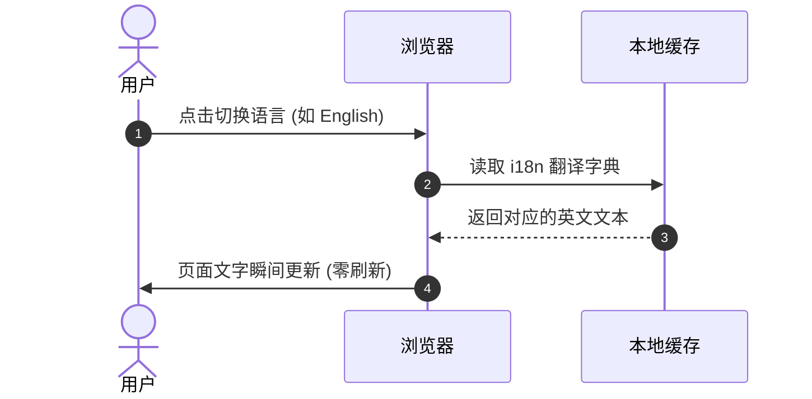

# 提示框、代码块与图表示例

编写高质量的技术文档，不仅需要清晰的文字，还需要醒目的重点提示、格式规整的代码范例和一目了然的流程图。**EpoCanvas Docs** 原生支持了丰富的扩展语法，帮助你轻松创作出富有表现力的技术内容。

---

## 1. 5 种彩色提示框 (Callouts)

在需要读者重点关注某些背景、操作技巧或危险风险时，可以使用 GitHub 风格的彩色提示框。

### 语法写法：
```markdown
> [!NOTE]
> 这是补充性的背景说明。

> [!TIP]
> 这是一个提高效率的小技巧。

> [!IMPORTANT]
> 这是一个必须注意的关键操作。

> [!WARNING]
> 这是一个潜在的风险警告。

> [!CAUTION]
> 这是一个涉及数据安全或破坏性操作的危险提醒。
```

### 实际渲染效果：

> [!NOTE]
> **NOTE (补充说明)**：用于介绍相关背景知识、补充设计细节或提示前置依赖。

> [!TIP]
> **TIP (实用技巧)**：用于分享能够提高操作效率的小妙招或最佳实践。

> [!IMPORTANT]
> **IMPORTANT (关键操作)**：必须严格遵守的执行步骤或核心配置项，跳过可能导致失败。

> [!WARNING]
> **WARNING (注意警告)**：提示可能存在的兼容性冲突、潜在错误或即将废弃的功能。

> [!CAUTION]
> **CAUTION (高危提醒)**：涉及数据丢失、生产环境覆盖或不可逆操作的最高级别警示。

---

## 2. 增强型代码块排版 (Code Blocks)

文档内置了现代的代码高亮器，支持几乎所有常见的编程语言，并提供了多种实用的代码块标注语法。

### 2.1 带有文件名标题与行号高亮
在代码围栏首行指定文件名标题 `title="..."`，并使用 `{行号}` 标注需要重点关注的行：

````markdown
```typescript title="src/config/site.ts" {2}
export const siteConfig = {
  name: 'EpoCanvas Docs', // 这一行会被高亮背景强调
  version: '1.2.0',
};
```
````

**渲染效果：**
```typescript title="src/config/site.ts" {2}
export const siteConfig = {
  name: 'EpoCanvas Docs',
  version: '1.2.0',
};
```

---

### 2.2 增量代码对比 (Diff 模式)
在展示代码重构或配置升级时，使用 `diff` 语言可以让改动一目了然：

````markdown
```diff
  export default defineConfig({
-   site: 'http://localhost:3000',
+   site: 'https://doc.epocanvas.com',
  });
```
````

**渲染效果：**
```diff
  export default defineConfig({
-   site: 'http://localhost:3000',
+   site: 'https://doc.epocanvas.com',
  });
```

---

## 3. 直接用文字画流程图 (Mermaid)

不需要打开画图软件截图，直接在 Markdown 中写文本，页面就能自动渲染出矢量图表：

### 3.1 横向流程图示例
````markdown

````

**渲染效果：**


---

### 3.2 时序图示例
````markdown

````

**渲染效果：**


通过灵活运用提示框、代码高亮和流程图，可以大大提升技术文档的阅读舒适度与专业感。
